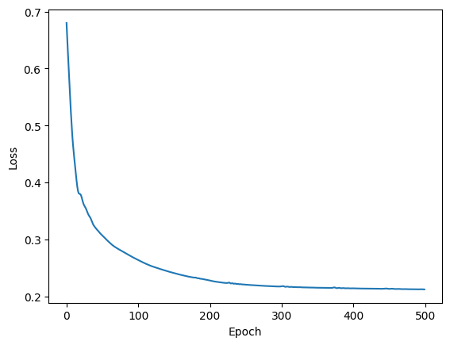

# Credit-Risk-NN
"A Deep Learning approach to predict loan default risk using PyTorch. This project utilizes an Artificial Neural Network (ANN) to classify borrowers based on financial history and demographic data, achieving ~92% accuracy."

# 💰 Credit Risk Prediction using PyTorch ANN

[](https://www.python.org/)
[](https://pytorch.org/)
[](https://pandas.pydata.org/)
[](https://www.kaggle.com/datasets/laotse/credit-risk-dataset)

## 📌 Project Overview
The objective of this project is to build a **Deep Learning Model** capable of predicting whether a loan applicant is likely to default (fail to pay) or not.

Using **Artificial Neural Networks (ANN)** implemented in PyTorch, this project analyzes various financial and demographic factors to perform binary classification:
* **0:** Non-Default (Safe/Lancar)
* **1:** Default (Risky/Macet)

This model is designed to help financial institutions minimize risk by identifying high-risk borrowers early.

## 📂 Dataset
The dataset contains historical data of loan applicants.
* **Target Variable:** `loan_status` (0 or 1).
* **Key Features:**
    * `person_income`: Annual Income.
    * `loan_int_rate`: Interest Rate.
    * `person_emp_length`: Employment length (in years).
    * `loan_grade`: Credit grade (A-G).
    * `cb_person_default_on_file`: Historical default status.
* **Source:** 👉 [Credit Risk Dataset on Kaggle](https://www.kaggle.com/datasets/laotse/credit-risk-dataset)

## 🛠️ Methodology

### 1. Data Preprocessing
* **Handling Missing Values:** Imputed missing values in `person_emp_length` and `loan_int_rate` using the **Median** strategy.
* **Feature Engineering:**
    * **One-Hot Encoding:** Applied to categorical variables like `home_ownership` and `loan_intent`.
    * **Label Mapping:** Converted ordinal data like `loan_grade` (A=0, B=1, etc.) into numerical format.
* **Scaling:** Used **`RobustScaler`** (instead of StandardScaler) to handle significant outliers in income data effectively.

### 2. Neural Network Architecture
We constructed a Multi-Layer Perceptron (MLP) using `torch.nn`:
* **Input Layer:** 19 Neurons (corresponding to encoded features).
* **Hidden Layer 1:** 12 Neurons (Activation: ReLU).
* **Hidden Layer 2:** 24 Neurons (Activation: ReLU).
* **Output Layer:** 2 Neurons (Binary Classification).
* **Optimizer:** Adam (`lr=0.01`).
* **Loss Function:** CrossEntropyLoss.

## 📊 Results & Performance

The model was trained for **500 Epochs**. Below is the evaluation result on the Test Set:

| Metric | Score | Analysis |
| :--- | :--- | :--- |
| **Accuracy** | **92.02%** | High accuracy indicates the ANN effectively learned the risk patterns. |
| **Loss** | *Low* | The loss curve showed consistent convergence without major overfitting. |

> *Note: The use of RobustScaler significantly helped the Neural Network stabilize gradients despite extreme values in the 'Income' column.*

## 📈 Visualizations

### Training Loss Curve

*The chart illustrates the decrease in loss over 500 epochs, showing the model learning progress.*

## 🚀 How to Run
1.  Clone this repository:
    ```bash
    git clone [https://github.com/nicolausprima/credit-risk-nn.git](https://github.com/nicolausprima/credit-risk-nn.git)
    ```
2.  Install the required libraries:
    ```bash
    pip install pandas numpy matplotlib scikit-learn torch
    ```
3.  Run the notebook:
    ```bash
    jupyter notebook CreditRiskNN.ipynb
    ```

## 🤝 Conclusion
This project demonstrates that a simple yet well-tuned **Artificial Neural Network** can achieve high accuracy (>92%) in credit risk assessment. The combination of proper preprocessing (**RobustScaler**) and deep learning architecture proves effective for tabular financial data.

---
*Created by [Nicolaus Prima]*
